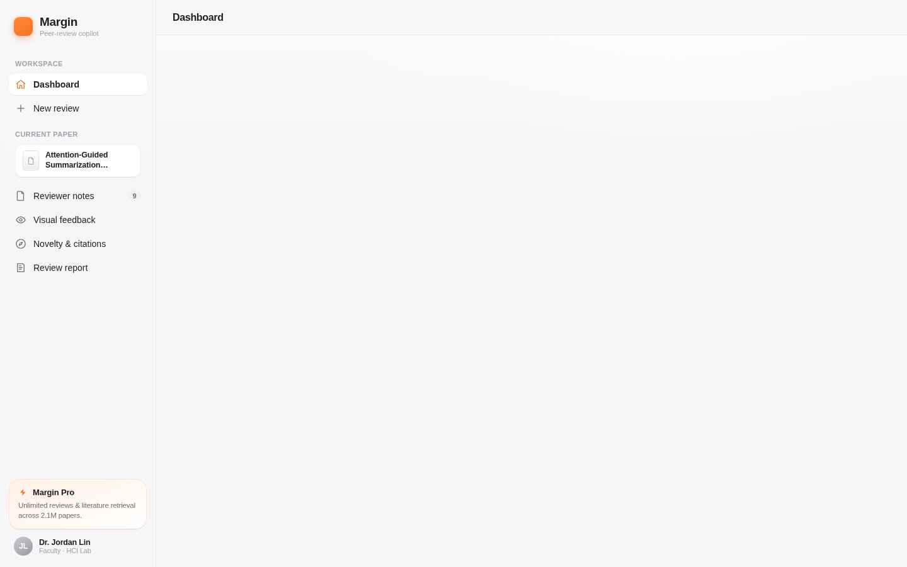

# Margin — Peer-Review Copilot

An AI copilot that reviews academic manuscripts the way a careful reviewer would:
writing quality, paper structure, methodology, logical consistency, novelty and
citation usage — with visual before/after feedback and a structured, exportable
review report. Built to reduce reviewer workload and help authors strengthen papers
before submission; human judgment stays in control.



## Features

- **Reviewer notes** — the manuscript with inline annotations linked to a feedback
  rail; suggested rewrites can be applied with one click
- **Visual feedback** — before/after comparisons of problematic figures and paragraphs
- **Novelty & citations** — similarity check against related work, missing-reference
  suggestions, novelty assessment
- **Review report** — an editable structured draft, exportable as Markdown or PDF
- **Copilot chat** (⌘J), **command palette** (⌘K), full **dark mode** (⌘⇧L)

Currently runs on realistic mock data; the service layer is designed so a real
Claude-API backend can be wired in without UI changes (see `CLAUDE.md`).

## Run it

**Prerequisite:** [Node.js](https://nodejs.org) 20 or newer (`node -v` to check),
which includes `npm`.

```bash
cd app
npm install    # first time only — downloads dependencies (~1–2 min)
npm run dev    # starts the dev server
```

Then open the URL it prints (usually http://localhost:5173). Everything runs
locally on mock data — no API keys or configuration needed.

Useful extras:

```bash
npm run build      # type-check + production build (into app/dist/)
npm run preview    # serve that production build locally
```

## Deploy

Push to a Git host and import in [Vercel](https://vercel.com) with the project root
directory set to `app/`. No other configuration needed.

## Project structure

- `app/` — the application (Vite + React + TypeScript)
- `Paper-reviewer/` — the original design prototype (frozen reference)
- `CLAUDE.md` — architecture & conventions
